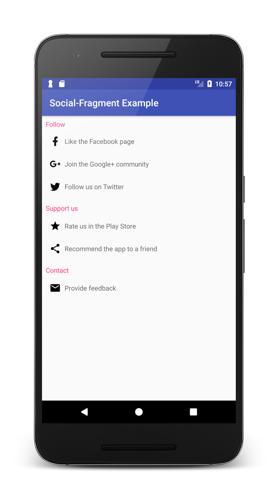
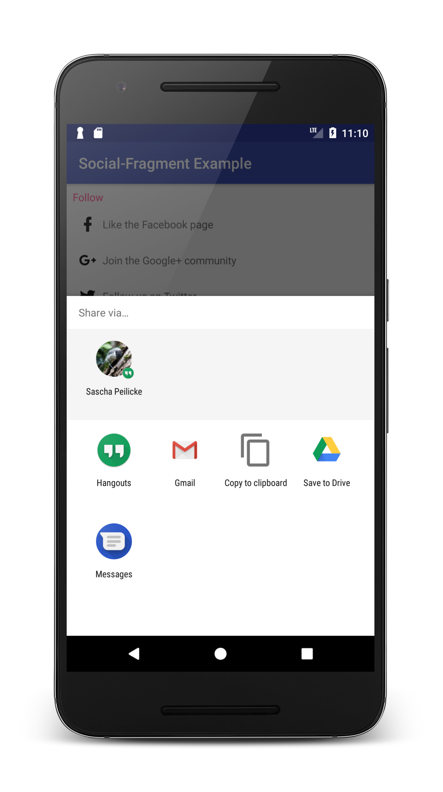
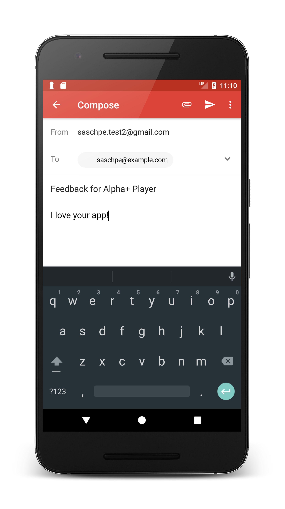

# Android Social Fragment
[](https://bintray.com/saschpe/maven/android-social-fragment/_latestVersion)
[](https://android-arsenal.com/details/1/5872)
[](http://www.apache.org/licenses/LICENSE-2.0.html)
[](https://travis-ci.org/saschpe/android-social-fragment)
<a href="http://www.methodscount.com/?lib=saschpe.android%3Asocial-fragment%3A1.0.0"></a>

A reusable fragment to display links to social networks, the Play Store as well
as recommendation and support email links. The fragment tries to open installed
apps on the user's device first and resorts to the web browser otherwise.

# Usage
Use the **SocialFragment.Builder** class to set up a new **SocialFragment**.
Only the values provided will appear. 

```java
// Set up social fragment
SocialFragment fragment =  new SocialFragment.Builder()
    // Mandatory
    .setApplicationId(BuildConfig.APPLICATION_ID)
    // Optional
    .setApplicationName(getString(R.string.app_name))
    .setContactEmailAddress("saschpe@example.com")
    .setFacebookGroup("466079123741258")
    .setGooglePlusGroup("116602691405798233571")
    .setTwitterProfile("saschpe")
    // Visual customization
    .setHeaderTextColor(R.color.accent)
    .build();

// Attach it to the parent activity
getSupportFragmentManager().beginTransaction()
    .add(R.id.fragment_placeholder,fragment)
    .commit();
```

# Screenshots




# Download
```groovy
compile 'saschpe.android:social-fragment:1.0.0'
```

Snapshots of the development version are available in [Sonatype's `snapshots` repository][snap].

# License

    Copyright 2017 Sascha Peilicke

    Licensed under the Apache License, Version 2.0 (the "License");
    you may not use this file except in compliance with the License.
    You may obtain a copy of the License at

       http://www.apache.org/licenses/LICENSE-2.0

    Unless required by applicable law or agreed to in writing, software
    distributed under the License is distributed on an "AS IS" BASIS,
    WITHOUT WARRANTIES OR CONDITIONS OF ANY KIND, either express or implied.
    See the License for the specific language governing permissions and
    limitations under the License.


 [snap]: https://oss.sonatype.org/content/repositories/snapshots/
